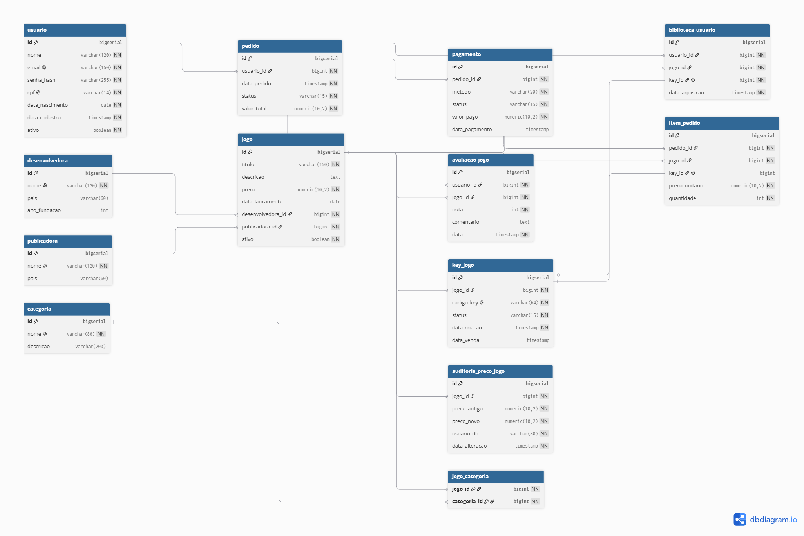

# SteamQuest — Trabalho de Banco de Dados

**Universidade Católica Dom Bosco (UCDB)** — Banco de Dados — 4º semestre

E-commerce fictício de jogos digitais inspirado na Steam. Controla usuários, jogos, **keys digitais limitadas**, pedidos, pagamentos, biblioteca, avaliações e auditoria de preço.

> **SGBD:** PostgreSQL
> **Modelagem:** dbdiagram.io ([der/steamquest.dbml](der/steamquest.dbml))

---

## Sumário

1. [Descrição do sistema](#descrição-do-sistema)
2. [Integrantes](#integrantes)
3. [Modelagem / DER](#modelagem--der)
4. [Tabelas](#tabelas)
5. [Ordem de execução dos scripts](#ordem-de-execução-dos-scripts)
6. [Plano de commits por dupla](#plano-de-commits-por-dupla)
7. [Índices](#índices)
8. [Roles e Permissões](#roles-e-permissões)
9. [Triggers e Funções](#triggers-e-funções)
10. [Transação de Finalizar Pedido](#transação-de-finalizar-pedido)
11. [Views e Relatórios](#views-e-relatórios)
12. [Dados Iniciais](#dados-iniciais)
13. [Prints de execução](#prints-de-execução)
14. [Regras de Negócio](#regras-de-negócio)

---

## Descrição do sistema

O SteamQuest é uma plataforma fictícia de e-commerce de jogos digitais
inspirada na Steam. O banco modela o ciclo completo de venda: catálogo
de jogos, controle de keys digitais limitadas, pedidos, pagamentos,
biblioteca do usuário e avaliações.

O diferencial do modelo é o controle rigoroso de keys: cada jogo possui
um estoque finito de chaves digitais únicas. Uma key vendida nunca pode
ser revendida, e o pedido só é finalizado se houver key disponível para
cada item — garantia feita pela transação `fn_finalizar_pedido`.


---

## Integrantes

> Cada aluno edita **apenas a sua linha**. A contribuição deve descrever o que
> foi efetivamente feito (script, trigger, view, etc).

| #   | Nome completo  | Dupla | Contribuição                          |
| --- | -------------- | ----- | ------------------------------------- |
| 01  | Heitor Fidelis | 1-2   | DER + script 01 de criação de tabelas |
| 02  | Felipe Rodrigues | 1-2   | DER do SteamQuest em DBML + imagem exportada + Atualização do README                        |
| 03  | Gabriel Felix  | 3-4   | Criação do script 03 de índices do banco de dados |
| 04  | Guilherme Acosta | 3-4   | Documentação dos índices e atualização do README |
| 05  | _A preencher_  | 5-6   | _A preencher_                         |
| 06  | _A preencher_  | 5-6   | _A preencher_                         |
| 07  | _A preencher_  | 7-8   | _A preencher_                         |
| 08  | _A preencher_  | 7-8   | _A preencher_                         |
| 09  | _A preencher_  | 9-10  | _A preencher_                         |
| 10  | _A preencher_  | 9-10  | _A preencher_                         |
| 11  | _A preencher_  | 11-12 | _A preencher_                         |
| 12  | _A preencher_  | 11-12 | _A preencher_                         |

---

## Modelagem / DER

<!-- DUPLA 1-2 — preencher -->
<!-- 1. Subir o .png exportado do dbdiagram.io em /der/steamquest.png
     2. Colocar o link de visualização compartilhável do dbdiagram aqui
     3. Inserir a imagem abaixo -->

- Arquivo-fonte: [der/steamquest.dbml](der/steamquest.dbml)
- Link de visualização:(https://dbdiagram.io/d/6a1f1c57f15b4b04525b11d8)
- Imagem: 


---

## Tabelas


| Tabela                 | Descrição                                                     |
| ---------------------- | ------------------------------------------------------------- |
| `usuario`              | Cliente da plataforma (email e CPF únicos).                   |
| `desenvolvedora`       | Estúdio que desenvolve o jogo.                                |
| `publicadora`          | Empresa que publica/distribui o jogo.                         |
| `jogo`                 | Catálogo de jogos digitais à venda.                           |
| `categoria`            | Gênero/categoria de jogo (RPG, FPS, Indie, etc).              |
| `jogo_categoria`       | Associativa N:N entre jogo e categoria.                       |
| `key_jogo`             | Key digital de um jogo (única e não-reutilizável).            |
| `pedido`               | Pedido feito por um usuário.                                  |
| `item_pedido`          | Item individual de um pedido, ligando jogo + key.             |
| `pagamento`            | Pagamento associado a um pedido.                              |
| `biblioteca_usuario`   | Jogos do usuário após pedido finalizado.                      |
| `avaliacao_jogo`       | Avaliação de um jogo por um usuário (nota 1 a 5).             |
| `auditoria_preco_jogo` | Log automático de alterações de preço (populado por trigger). |

---

## Ordem de execução dos scripts

Executar **nesta ordem exata** num banco PostgreSQL limpo:

```bash
psql -U postgres -d steamquest -f scripts/01_criacao_tabelas.sql
psql -U postgres -d steamquest -f scripts/03_indices.sql
psql -U postgres -d steamquest -f scripts/04_roles_permissoes.sql
psql -U postgres -d steamquest -f scripts/05_funcoes_triggers.sql
psql -U postgres -d steamquest -f scripts/06_views_relatorios.sql
psql -U postgres -d steamquest -f scripts/07_dados_iniciais.sql
psql -U postgres -d steamquest -f scripts/08_transacao_finalizar_pedido.sql
```

| Script                              | Responsável | Status      |
| ----------------------------------- | ----------- | ----------- |
| `01_criacao_tabelas.sql`            | Dupla 1-2   | ✅ Pronto   |
| `03_indices.sql`                    | Dupla 3-4   | ✅ Pronto   |
| `04_roles_permissoes.sql`           | Dupla 5-6   | ⬜ Pendente |
| `05_funcoes_triggers.sql`           | Dupla 7-8   | ⬜ Pendente |
| `06_views_relatorios.sql`           | Dupla 11-12 | ⬜ Pendente |
| `07_dados_iniciais.sql`             | Dupla 11-12 | ⬜ Pendente |
| `08_transacao_finalizar_pedido.sql` | Dupla 9-10  | ⬜ Pendente |

---

## Plano de commits por dupla

> **Regra de avaliação:** cada aluno precisa ter **no mínimo 2 commits relevantes** com autoria própria. Commits vazios, alterações mínimas ou só correção de acento **não contam**.
>
> Por isso, **dentro de cada dupla o trabalho é dividido antes de começar**. Cada aluno fica responsável por um pedaço lógico do script + uma seção do README. Assim, cada um faz 1 commit `feat:` (código) + 1 commit `docs:` (documentação) — 2 commits relevantes.

### Convenção de mensagens

| Prefixo  | Quando usar                                    |
| -------- | ---------------------------------------------- |
| `feat:`  | Nova funcionalidade (tabela, índice, trigger…) |
| `fix:`   | Correção de bug ou de constraint               |
| `docs:`  | Edição no README ou comentários no código      |
| `chore:` | Estrutura, gitignore, organização              |
| `test:`  | Inserção de exemplos / dados de teste          |

### 🟦 Dupla 1-2 — DER + Criação de tabelas

| Aluno   | Commit 1 (feat)                                                                                                          | Commit 2 (docs)                                              |
| ------- | ------------------------------------------------------------------------------------------------------------------------ | ------------------------------------------------------------ |
| Aluno A | `chore: estrutura inicial do repositorio` (`.gitignore` + esqueleto do README) + `feat: script 01 de criacao de tabelas` | `feat: script 01 de criacao de tabelas` (em commit separado) |
| Aluno B | `feat: DER do SteamQuest em DBML` (`der/steamquest.dbml` + `der/steamquest.png` exportado do dbdiagram.io)               | `docs: preenche descricao, modelagem e tabelas no README`    |

### 🟩 Dupla 3-4 — Índices

| Aluno   | Commit 1 (feat)                                              | Commit 2 (docs)                                              |
| ------- | ------------------------------------------------------------ | ------------------------------------------------------------ |
| Aluno A | `feat: indices em key_jogo, pedido e item_pedido`            | `docs: explica indices de keys e pedidos no README`          |
| Aluno B | `feat: indices em biblioteca_usuario, avaliacao_jogo e jogo` | `docs: explica indices de biblioteca e avaliacoes no README` |

### 🟧 Dupla 5-6 — Roles e Permissões

| Aluno   | Commit 1 (feat)                                      | Commit 2 (docs)                                          |
| ------- | ---------------------------------------------------- | -------------------------------------------------------- |
| Aluno A | `feat: cria roles admin_sq e operador_sq com GRANTs` | `docs: documenta roles admin e operador no README`       |
| Aluno B | `feat: cria role cliente_sq com GRANTs e REVOKEs`    | `docs: documenta role cliente e estrategia de seguranca` |

### 🟪 Dupla 7-8 — Triggers e Funções

| Aluno   | Commit 1 (feat)                                    | Commit 2 (feat / docs)                                 |
| ------- | -------------------------------------------------- | ------------------------------------------------------ |
| Aluno A | `feat: trigger de auditoria de preco`              | `feat: trigger de calculo de valor_total no pedido`    |
| Aluno B | `feat: trigger de validacao de status em key_jogo` | `feat: trigger biblioteca pos-pedido + docs no README` |

### 🟥 Dupla 9-10 — Transação de Finalizar Pedido

| Aluno   | Commit 1 (feat)                                                      | Commit 2 (test / docs)                                        |
| ------- | -------------------------------------------------------------------- | ------------------------------------------------------------- |
| Aluno A | `feat: funcao fn_finalizar_pedido com lock do pedido (FOR UPDATE)`   | `test: exemplo de chamada bem-sucedida da transacao`          |
| Aluno B | `feat: reserva de keys com FOR UPDATE SKIP LOCKED + RAISE EXCEPTION` | `test: exemplo de ROLLBACK quando falta key + docs no README` |

### 🟨 Dupla 11-12 — Views, Dados Iniciais e Fechamento do README

| Aluno   | Commit 1 (feat)                                                                                                      | Commit 2 (feat / docs)                                          |
| ------- | -------------------------------------------------------------------------------------------------------------------- | --------------------------------------------------------------- |
| Aluno A | `feat: views vw_top_jogos_vendidos e vw_receita_por_mes` + INSERTs de usuários, devs, publishers, categorias e jogos | `docs: prints de execucao + secao Views e Relatorios no README` |
| Aluno B | `feat: views vw_media_avaliacao_por_jogo e vw_estoque_keys` + INSERTs de keys, pedidos e avaliações                  | `docs: secao Dados Iniciais + revisao final do README`          |

### Como cada aluno garante a própria autoria

No PC de cada um, antes do primeiro commit:

```bash
git config user.name "Seu Nome Completo"
git config user.email "seu_email@dominio.com"
```

Para conferir antes de commitar:

```bash
git config user.name
git config user.email
```

---

## Índices

<!-- DUPLA 3-4 — preencher -->
<!-- Para cada índice criado em scripts/03_indices.sql, escrever 1 linha:
     - NOME do índice
     - TABELA e colunas
     - QUAL consulta ele acelera (justificativa) -->

- **`idx_key_jogo_jogo_status`** (`key_jogo(jogo_id, status)`) — Acelera a busca de chaves digitais disponíveis (filtradas por status) para um determinado jogo, otimizando o processo de venda.
- **`idx_pedido_usuario`** (`pedido(usuario_id)`) — Acelera a consulta e exibição do histórico de pedidos de um usuário na plataforma.
- **`idx_pedido_status`** (`pedido(status)`) — Otimiza relatórios e consultas que filtram pedidos pelo estado da compra (ex: pendente, finalizado, cancelado).
- **`idx_item_pedido_pedido`** (`item_pedido(pedido_id)`) — Agiliza a busca de todos os itens vinculados a um pedido específico ao exibir os detalhes do carrinho ou da compra.
- **`idx_item_pedido_jogo`** (`item_pedido(jogo_id)`) — Acelera consultas de vendas e estatísticas de popularidade por jogo.
- **`idx_biblioteca_usuario`** (`biblioteca_usuario(usuario_id)`) — Acelera a listagem de jogos que pertencem à biblioteca de um usuário específico.
- **`idx_avaliacao_jogo`** (`avaliacao_jogo(jogo_id)`) — Otimiza consultas para calcular a média de notas de um jogo e listar suas avaliações correspondentes.
- **`idx_avaliacao_usuario`** (`avaliacao_jogo(usuario_id)`) — Acelera a busca de todas as avaliações que um usuário específico realizou.
- **`idx_jogo_titulo`** (`jogo(titulo)`) — Otimiza a pesquisa de jogos por título na barra de buscas da loja, acelerando a filtragem por texto.

---

## Roles e Permissões

<!-- DUPLA 5-6 — preencher -->
<!-- Tabela com as 3 roles criadas em scripts/04_roles_permissoes.sql.
     Para cada uma, explicar: o que pode SELECT, INSERT, UPDATE, DELETE. -->

_A preencher pela Dupla 5-6._

| Role          | Permissões    |
| ------------- | ------------- |
| `admin_sq`    | Role administrativa do sistema. Possui permissão de `SELECT`, `INSERT`, `UPDATE` e `DELETE` em todas as tabelas do schema `public`, além de permissão de uso, consulta e atualização das sequences.  |
| `operador_sq` | Role voltada para operadores internos da plataforma. Pode consultar usuários, gerenciar catálogo, desenvolvedoras, publicadoras, categorias, jogos, keys, pedidos, itens, pagamentos e biblioteca. Possui permissão de `SELECT`, `INSERT` e `UPDATE` nas tabelas operacionais, apenas `SELECT` em avaliações e auditoria de preços, e não possui permissão de `DELETE`. |
| `cliente_sq`  | _A preencher_ |

---

## Triggers e Funções

<!-- DUPLA 7-8 — preencher -->
<!-- Para cada trigger em scripts/05_funcoes_triggers.sql, escrever:
     - NOME do trigger
     - EVENTO (BEFORE/AFTER, INSERT/UPDATE/DELETE, em qual tabela)
     - OBJETIVO (regra de negócio que ele garante) -->

_A preencher pela Dupla 7-8._

- **`trg_auditoria_preco_jogo`** — _A preencher_
- **`trg_atualiza_valor_total`** — _A preencher_
- **`trg_key_validacao`** — _A preencher_
- **`trg_biblioteca_pos_pedido`** — _A preencher_

---

## Transação de Finalizar Pedido

<!-- DUPLA 9-10 — preencher -->
<!-- Explicar passo a passo o que a função fn_finalizar_pedido() faz:
     1. Como trava o pedido (SELECT ... FOR UPDATE)
     2. Como reserva uma key disponível por item (FOR UPDATE SKIP LOCKED)
     3. O que acontece se faltar key
     4. Como atualiza status, gera pagamento e dispara o trigger de biblioteca
     Incluir exemplo de chamada da função. -->

_A preencher pela Dupla 9-10._

---

## Views e Relatórios

<!-- DUPLA 11-12 — preencher -->
<!-- Para cada view criada em scripts/06_views_relatorios.sql:
     - NOME da view
     - O QUE ela mostra
     - Pequeno exemplo de SELECT -->

_A preencher pela Dupla 11-12._

- **`vw_top_jogos_vendidos`** — _A preencher_
- **`vw_receita_por_mes`** — _A preencher_
- **`vw_media_avaliacao_por_jogo`** — _A preencher_
- **`vw_estoque_keys`** — _A preencher_

---

## Dados Iniciais

<!-- DUPLA 11-12 — preencher -->
<!-- Resumir o que tem em scripts/07_dados_iniciais.sql:
     - Quantos usuários, jogos, keys, pedidos, avaliações
     - Estados variados (pedido pendente / finalizado / cancelado, etc) -->

_A preencher pela Dupla 11-12._

---

## Prints de execução

<!-- DUPLA 11-12 — coordenar; cada dupla pode adicionar o print da sua parte -->
<!-- Salvar imagens em /prints/ e referenciá-las aqui. -->

_A preencher._

---

## Regras de Negócio

Regras garantidas pelo banco (via constraints, triggers e a transação):

- Um usuário pode realizar vários pedidos.
- Um pedido pode conter vários jogos.
- Um jogo pode pertencer a várias categorias (e vice-versa).
- Um jogo pode possuir várias keys digitais; **cada key é única**.
- Status válidos de key: `disponivel`, `reservada`, `vendida`, `cancelada`.
- **Uma key vendida não pode ser vendida novamente.**
- **Um usuário não pode receber duas vezes a mesma key.**
- O total do pedido é calculado a partir dos itens (trigger).
- **Um pedido só é finalizado se houver key disponível para cada jogo comprado.**
- Ao finalizar o pedido, o jogo entra automaticamente na biblioteca do usuário.
- Preço de jogo nunca pode ser negativo; quantidade nunca pode ser ≤ 0.
- Dados duplicados indevidos são bloqueados por `UNIQUE` (email, CPF, código de key, par usuário+jogo em avaliação, etc).

---

## Estrutura do repositório

```
├── README.md                ← este arquivo
├── .gitignore
├── der/
│   ├── steamquest.dbml      ← fonte (dbdiagram.io)
│   └── steamquest.png       ← imagem exportada
├── scripts/
│   ├── 01_criacao_tabelas.sql
│   ├── 03_indices.sql
│   ├── 04_roles_permissoes.sql
│   ├── 05_funcoes_triggers.sql
│   ├── 06_views_relatorios.sql
│   ├── 07_dados_iniciais.sql
│   └── 08_transacao_finalizar_pedido.sql
├── prints/                  ← screenshots de execução
└── docs/                    ← anotações extras
```
